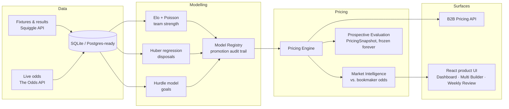

# AFL Pricing & Market Intelligence Engine

A full-stack sports analytics platform that prices AFL (Australian Football League) team and player markets from first principles, benchmarks those prices against real bookmaker odds, and tracks — honestly and prospectively — whether its own models actually contain predictive information. Built as a solo project to be commercially credible: the kind of engine a sportsbook, sports-data company, or betting-tech platform could plausibly evaluate as a pricing feed.

`Python · FastAPI · SQLAlchemy · scikit-learn · statsmodels · React · TypeScript`

## Why this project

Most "sports prediction" side projects stop at a model that outputs a number. This one is built around the harder, more realistic engineering problem: **how do you know your model is actually good, and how do you keep it honest as it evolves?**

- **Leakage-safe, walk-forward feature engineering** — every feature is built strictly from information available before the game it predicts, with adversarial tests that prove a target match's own stats can never reach its own prediction.
- **Chronological train/holdout discipline, everywhere** — models are tuned on early seasons and evaluated on a later holdout the tuning process never saw. No k-fold shuffling of time-series data.
- **A model registry with a permanent, append-only promotion audit trail** — every champion/challenger comparison, its evidence, and its outcome is recorded and never overwritten, so "why is this the promoted model" always has a real, inspectable answer.
- **A prospective evaluation dataset, kept structurally separate from backtests** — every price generated for a still-future match is frozen at generation time and never revised, so "does this model actually work going forward" can eventually be answered from data the model never touched, instead of a backtest that quietly leaked the future.
- **Research discipline over model complexity** — several research stages (an elite-player disposal-bias study, an SGM/same-game-multi correlation study, a player-role/archetype study, a usage-change detector) explicitly conclude "no, this doesn't help" as often as "yes" — and only ship the findings that survive held-out evidence.

## What it does

- **Team markets**: H2H, line, and total-points pricing from an Elo + Poisson team-strength ensemble.
- **Player markets**: disposal and goal pricing at any threshold (not just preset lines), via a robust regression + hurdle/negative-binomial distribution pipeline, complete with calibration metrics and prediction intervals.
- **Market intelligence**: de-vigged, multi-bookmaker consensus pricing compared against the model's own belief, with outlier-price and staleness detection.
- **A B2B-style pricing API** (`/api/v1/pricing`, `/market-intelligence`, `/model-registry`, `/integration-health`) with OpenAPI docs, real captured example responses, and a benchmarked performance profile — designed to be handed to another engineering team, not just a UI.
- **A product surface on top of the same pricing core**: a live dashboard, per-match detail pages, a prop-market opportunity finder, a correlation-aware Multi Builder (never fabricates a joint probability it hasn't earned), a Weekly Review shortlist, and a Placed Bets tracker for closing the loop on real results.
- **Model-risk metadata, not black-box confidence**: when a player's recent usage pattern diverges materially from their own established baseline, the API surfaces a plain-language, evidence-backed risk flag — without silently reweighting the probability it's attached to.

## Architecture



## Modelling & evaluation highlights

| Model | Approach | Validated result |
|---|---|---|
| Match winner | Margin-of-victory-adjusted Elo | Brier 0.2012, 68.1% accuracy on a holdout the tuning process never saw |
| Line / total points | Poisson team-strength (goals & behinds modelled separately, not raw points) | Margin predictions beat a naive baseline by 13%; total-points reported honestly as *not yet* beating naive |
| Player disposals | Huber regression (robust to outliers) over NB2 count distribution | Promoted over Ridge after a dedicated bias study: MAE 3.931→3.907, elite-player under-prediction bias roughly halved, won on MAE in all 8 evaluated seasons |
| Player goals | Two-part hurdle model (P(scores) classifier + zero-truncated count) | Chosen over a plain count model after confirming genuine zero-inflation in the data, not assumed |

Two research findings are reported and *not* acted on, deliberately: a controlled study confirmed elite disposal-getters are systematically under-predicted (plausibly Ridge shrinkage) without deploying an unvalidated fix, and a same-game-multi correlation study found most player-pair correlations are negligible — so the Multi Builder still never presents a fabricated joint probability, only each leg's own number.

## Tech stack

- **Backend** — Python, FastAPI, SQLAlchemy 2.0, Alembic, Pydantic v2, scikit-learn, statsmodels, XGBoost/LightGBM (research comparisons), pytest (**1,453 tests**)
- **Frontend** — React 19, TypeScript, React Router, Vite, Vitest
- **Data** — SQLite for local dev (Postgres-ready via one env var), Squiggle API (fixtures/results), The Odds API (live bookmaker prices)

~35k lines of backend Python across 242 modules, ~13k lines of frontend TypeScript across 47 files.

## Project layout

```
AFL/
  backend/
    app/            FastAPI routes, pricing engine, ML models, live-data pipeline
    scripts/        Research scripts (bias studies, model comparisons) — read-only, never touch production
    docs/            API usage guide, pricing-engine technical writeup, captured example responses
    tests/          1,453 tests
  frontend/
    src/pages/      Dashboard, Match Detail, Player Insights, Prop Insights, Multi Builder,
                    Weekly Review, Placed Bets, Model Registry, B2B Demo, ...
    src/components/ Shared UI (opportunity drawers, projection tables, multi-leg builder)
  B2B_DEMO.md       Product-facing writeup: problem, methodology, limitations, integration flow
```

## Getting started

**Backend**
```bash
cd backend
python -m venv .venv
.venv\Scripts\pip install -r requirements.txt
copy .env.example .env
.venv\Scripts\python -m alembic upgrade head
.venv\Scripts\python -m uvicorn app.main:app --reload
```
API at `http://localhost:8000` — interactive docs at `/docs`, health checks at `/api/health`.

**Frontend**
```bash
cd frontend
npm install
copy .env.example .env
npm run dev
```
App at `http://localhost:5173`.

**Tests**
```bash
cd backend && .venv\Scripts\python -m pytest -q
cd frontend && npm run build   # tsc -b + vite build
```

See [`backend/docs/API_USAGE.md`](backend/docs/API_USAGE.md) for API-level details (auth/rate-limit posture, response times, error formats) and [`B2B_DEMO.md`](B2B_DEMO.md) for the product-facing writeup.
