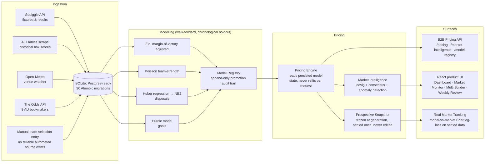
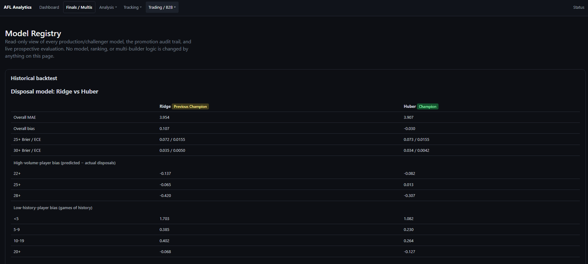
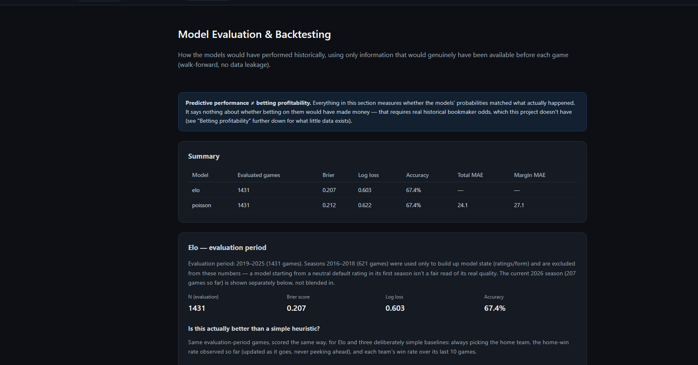
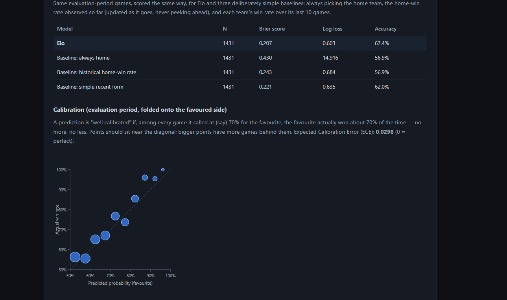
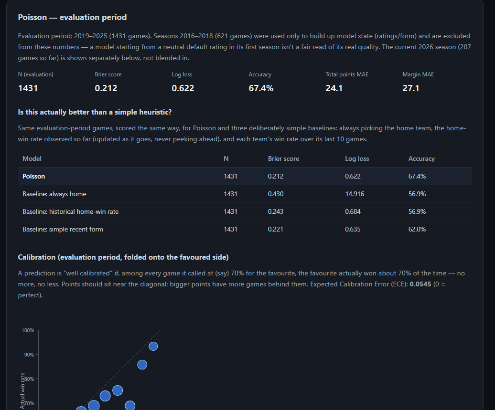
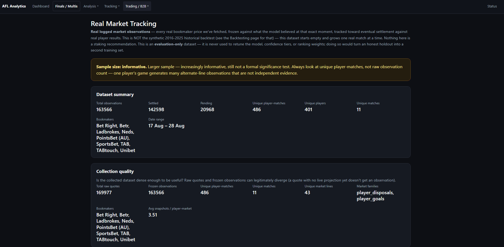
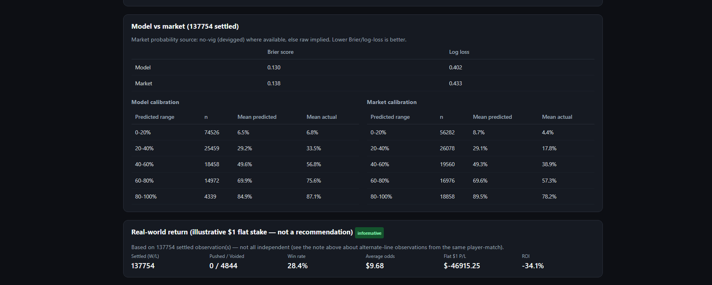

# AFL Pricing & Market Intelligence Engine

A pricing and market-intelligence system for Australian Football League markets: it fits team- and player-performance models on historical data, turns them into probabilistic forecasts and fair prices for arbitrary team and player markets, and benchmarks those prices against real bookmaker odds pulled live from nine Australian bookmakers. The project is not "an app that predicts AFL bets" — it's an exploration of the actual hard problem in sports pricing: whether a model contains genuine predictive information once you refuse to let it cheat, and how you'd know either way.

`Python · FastAPI · SQLAlchemy 2.0 · scikit-learn · statsmodels · XGBoost/LightGBM (research) · React 19 · TypeScript`

~39k lines of backend Python across 270 modules, ~14.5k lines of frontend TypeScript across 49 files, 1,540 backend tests.

## What this system does

Historical AFL results (Squiggle, AFLTables) and live bookmaker odds (The Odds API, 9 AU books)
→ point-in-time features
→ walk-forward model fitting (Elo, Poisson, Huber regression, hurdle model)
→ versioned, promotion-gated model registry
→ probabilistic forecasts → fair prices at any threshold
→ market intelligence (devig, cross-book consensus, anomaly detection)
→ a price frozen at generation time, before the outcome exists
→ settlement once the match completes
→ a model-vs-market performance report, kept separate from the historical backtest

Every stage above is implemented and running against live data as of this write-up — none of it is aspirational.

## Why I built it

Most sports-prediction side projects stop at a model that outputs a number. The more interesting (and more realistic) problem is the one every quant/trading team actually has to solve: does the model contain real information, or does it just look good because of how it was evaluated? Leakage, retrospective threshold-picking, and re-testing on the same holdout until something clears the bar can all produce a model that looks great and is worthless. This project is built around closing off those failure modes — point-in-time features, chronological holdouts, a model registry that can't quietly swap a champion, and a prospective evaluation pipeline that freezes every price before the outcome is known — rather than around adding modelling sophistication for its own sake.

## System architecture



## Modelling

**Team markets** — an Elo rating with a margin-of-victory adjustment (`log(margin+1)` scaling on the rating update, so a 90-point win moves ratings more than a 1-point win, but not linearly) drives H2H pricing; a Poisson team-strength model (goals and behinds modelled as separate count processes, not raw points) drives line and total-points pricing, since it can be scored at any arbitrary handicap or total, not just the market's posted line.

**Player disposals** — rolling-form features (3/5/10-game and season/career averages, EWMA) feed a robust Huber regression for the expected count, priced through a Negative-Binomial (NB2) distribution fit on holdout residual dispersion. Huber was promoted over an earlier Ridge model after a dedicated bias study (below) — a real, recorded promotion event, not a retroactive story.

**Player goals** — a hurdle model: a separate classifier for "scores at least once" plus a zero-truncated count for the scored-at-least-once distribution. This was chosen after directly auditing the zero-inflation in the data (actual P(0 goals) = 66.8% vs. 58.8% implied by a plain Poisson fit) — the two-part structure exists because the data demanded it, not by default.

**Complexity was tested, not assumed.** XGBoost and LightGBM boosting models were built and run through the same promotion pipeline (Brier win, log-loss non-regression, ECE ≤ 0.08, majority-of-seasons win, bootstrap CI excluding zero) as every other candidate. The result, recorded in the model registry: an optimal ensemble weight of `0.0` for the boosting model against Elo — i.e. the simpler model won on holdout and the more complex one was rejected, not shipped anyway for the sake of using it.

| Model | Approach | Backtested result (2019–2025 holdout) |
|---|---|---|
| Team H2H | Margin-of-victory Elo | Brier 0.207, 67.4% accuracy, n=1431 (2019–2025 holdout) |
| Team line | Poisson team-strength | MAE 27.22 vs. 31.29 naive baseline — ~13% better |
| Team total points | Poisson team-strength | MAE 23.06 vs. 23.52 naive — reported honestly as *not yet* beating naive |
| Player disposals | Huber regression → NB2 | MAE 3.907 (vs. 3.954 for the Ridge model it replaced); won on MAE in all 8 evaluated seasons |
| Player goals | Hurdle (classifier + zero-truncated NB) | Chosen after confirming genuine zero-inflation, not assumed |
| Boosting (XGBoost/LightGBM) | Gradient boosting ensemble candidate | Rejected — 0.0 recommended ensemble weight against Elo on holdout |

The Model Registry page shows the actual promotion evidence behind the disposals row above — not just one overall MAE, but bias broken down by disposal-volume bucket (22+, 25+, 28+) and by games-of-history bucket (Ridge's shrinkage shows up exactly where you'd expect: worse on high-volume players, better on thin-history ones):



Accuracy is deliberately not the headline number: the promotion gate is built on Brier score, log-loss, and expected calibration error (proper scoring rules that penalize overconfidence), not raw hit-rate, which a model can inflate by always picking the favourite. A dedicated calibration step (`calibration_methods.py`) fits Platt scaling or isotonic regression on inner out-of-sample folds and only adopts either if it improves Brier by more than 0.0005 *and* doesn't regress log-loss by more than 0.02 — recalibration has to earn its place too.

Two research findings were deliberately **not** acted on: a controlled OLS study of the disposal model's residual bias (n=62,173 player-games) found the under-prediction of elite disposal-getters survives controlling for sample size, season, and time-on-ground — consistent with Ridge-style shrinkage, but not confirmed as the cause, and no fix was shipped without held-out evidence. A same-game-multi correlation study (Spearman correlations across 101,521 player-match rows) found most player-pair correlations negligible (ρ < 0.03), with the one real signal being a player's own output vs. their own team's match outcome — so the Multi Builder still never fabricates a joint probability for combined legs (see below).

## Preventing leakage

This is the part of the project built to survive scrutiny, not just pass a demo.

- **Point-in-time features.** `build_match_features` iterates matches in strict chronological order and takes a snapshot of each team's rolling history *before* updating that history with the current match's own result — a match's own stats are structurally unable to reach its own prediction.
- **Adversarial tests, not just a docstring claim.** `test_leakage_and_determinism.py` builds a walk-forward run, appends a match dated after every existing match, and asserts every original prediction is byte-identical to the pre-append run — for Elo, Poisson, and all three baseline models. `test_ml_pipeline_leakage.py` goes further: it calls `.predict()` on wildly out-of-distribution evaluation rows and asserts the fitted scaler's `mean_`/`scale_` arrays are unchanged afterward, proving inference can't silently refit on the data it's being scored against.
- **Chronological, not k-fold, splitting.** Every backtest (`elo_backtest.py`, `poisson_backtest.py`, `disposal_backtest.py`, `goal_backtest.py`) sorts by `(scheduled_start, match_id)` and tunes only on seasons before a hardcoded `EVALUATION_START_YEAR = 2019`, evaluating strictly on seasons at or after it. No shuffled cross-validation touches this data anywhere.
- **Bootstrap confidence intervals, not just point estimates.** `bootstrap_metric_difference` resamples matches with replacement (2,000 resamples, fixed seed) and reports whether a metric improvement's 95% CI excludes zero — a point-estimate win alone doesn't clear the promotion gate.
- **Out-of-sample ablation.** Feature-group ablation, single-feature ablation, and permutation importance (20 repeats, fixed seed) are all refit on the tune split and scored only on the held-out eval split — never in-sample.

## From probability to price

Every priced market returns `model_fair_odds = 1 / probability` — a fair price computed independently of whether any bookmaker currently quotes that exact market. Because disposal and goal pricing reads a fitted parametric distribution (NB2, hurdle) rather than a lookup table, it can price *any* threshold on demand — a trader asking for a 27.5-disposal line that no bookmaker has posted gets a real answer, not a "not supported."

No model is ever fit inside a pricing request: team context is fit once per session via walk-forward replay, and player pricing reads already-persisted projection rows (a full disposal regression refit costs ~70–80 seconds — explicitly too slow for a request path, so the live cycle refreshes projections asynchronously and pricing only ever reads).

## Real market integration

Live odds come from The Odds API (`aussierules_afl`, AU region) across nine bookmakers (Bet Right, Betr, Ladbrokes, Neds, PointsBet AU, SportsBet, TAB, TABtouch, Unibet). Overround removal is **proportional (multiplicative) de-vig, explicitly not Shin's method or the power method** — a real, disclosed methodological choice rather than an unstated assumption, applied same-book where a paired quote exists; a separate consensus layer aggregates de-vigged prices across books and flags outliers.

The concepts below are kept structurally distinct throughout the codebase, and this README keeps them distinct too:

| Concept | What it is | Where it comes from |
|---|---|---|
| Model fair price | `1 / model probability` | Fitted model, no market input |
| Bookmaker price | The quoted decimal odds | The Odds API, per book |
| Implied probability | `1 / bookmaker price` (raw, includes vig) | Derived from the quote |
| Devigged / consensus probability | Overround-removed, cross-book | `edges/overround.py`, `consensus_and_outliers.py` |
| Model vs. market difference (`difference_pp`) | Model probability − consensus probability | A comparison number, not a bet recommendation |
| Demonstrated betting profitability | Whether this would actually have made money | Only answerable from settled, prospectively-logged data — see below |

**Market Monitor** is a separate anomaly-detection layer over this same data: rule-based (no LLM, no free-text generation) detection of model-vs-consensus divergence, cross-book price dispersion, non-monotonic player pricing curves, a single book's own two-sided quote implying less than 100% (an internal consistency check — a real arbitrage-adjacent bug class in bookmaker pricing), and stale quotes relative to a lineup change. Each flagged case is root-caused into a named category and, once the underlying event resolves, tagged with an outcome taxonomy (e.g. "market moved toward model") — again, describing what happened, never labelling it a win.

**Multi Builder** combines legs into finals/same-game multis without ever computing a fabricated joint probability: it shows each leg's own probability, and a pairing found (by the correlation research above) to be strongly correlated — e.g. a team's own H2H result combined with that same team's line — is hard-rejected outright rather than priced as if independent; a moderately-correlated pairing is kept but surfaced with an explicit correlation warning.

## Prospective evaluation

A backtest can look good and still be an artifact of hindsight. The only way to answer "does this actually work going forward" honestly is to freeze a prediction before the outcome exists and never touch it again. Two mechanisms do this, at two different levels of maturity — kept structurally and narratively separate here on purpose.

**Player props — real evidence exists.** Every automated bookmaker quote ingested by the live cycle is paired with a frozen copy of the model's belief at that exact moment (`PropMarketObservation`) — model probability, fair odds, lineup status, all frozen at creation; only three settlement fields are ever written afterward, exactly once, by reusing the same match-result primitives that settle placed bets. As of this write-up: 163,566 logged observations across 9 bookmakers and 401 players, spanning 17–28 August 2026, with 142,598 rows already settled. Because one player-match line gets repriced at many thresholds and refreshed on every cycle, the raw row count overstates the real sample size — the system's own reporting code tracks the unique-player-match count specifically to prevent that, and **354 unique player-matches have a settled win/lose outcome**, which the code itself labels "informative — still not a formal significance test," not a claim of statistical proof.

Over those 354 player-matches, the model's own probabilities scored **modestly better calibrated** than the market's de-vigged probabilities: Brier 0.130 vs. 0.138, log-loss 0.402 vs. 0.433. That is a real, prospectively-logged, settled-outcome result — and it is *only* a calibration comparison. It is not a profitability claim: a flat $1 stake on every logged observation over this window returned **-34.1% ROI**, and ROI broken out by the model's own edge-size and confidence buckets is noisy and non-monotonic at current sample sizes (56–342 unique player-matches per bucket) rather than cleanly increasing with edge, which is exactly what you'd expect from a real but early dataset, not a reason to pick a favourable-looking bucket and call it a result. The evaluation module is explicit that this dataset must never be used to retune the model it's evaluating — doing so would quietly convert an honest holdout into a second training set.

**Team markets — infrastructure is live, evidence is not there yet.** A newer, more general mechanism (`PricingSnapshot`) freezes team and player prices under a uniqueness constraint keyed on `(match, market, selection, model_version)` — attempting to write an already-frozen price is a no-op, not an overwrite. As of this write-up it holds 841 frozen prices and **zero settled outcomes**, because only 4 fixtures remain scheduled in the current season. This is stated plainly rather than papered over: the infrastructure is real and running, the evidence to draw a conclusion from isn't there yet, and it will accumulate honestly across the next season rather than being backfilled.

## Product

A React 19 / TypeScript product surface sits on top of the same pricing core (no separate demo backend):

| Page | What it shows |
|---|---|
| Dashboard | Round-wide overview, best-opportunity edge table, system status |
| Match Detail | Model-vs-market win probabilities side by side, odds panel, player pricing, Multi Builder |
| Prop Insights | 12-tab prop-shopping console: model probability, best price, devigged market probability, edge, EV, confidence, freshness |
| Multis / Multi Builder | Per-leg probabilities plus correlation-warning chips — never a combined probability |
| Market Monitor | Trader-inbox view of anomaly cases ranked by a transparent, component-scored priority |
| Real Market Tracking | The prospective evaluation numbers above, rendered as calibration tables and ROI bucket breakdowns |
| Model Registry | Champion/challenger history, Ridge-vs-Huber head-to-head, the promotion audit trail |
| Backtest | Historical calibration charts, baseline comparisons, logistic/boosting/Poisson-revision reports |
| Weekly Review, Placed Bets, Live Status, Team Selection | Weekly shortlist triage, a personal bet ledger with settled P&L, live-cycle operational health, manual lineup entry |

**Backtest** — the reliability diagram plotting predicted probability against actual win rate, alongside the naive-baseline comparison table (same screenshot the Modelling numbers above come from):





**Real Market Tracking** — the live, growing dataset behind the Prospective Evaluation numbers above:




Not yet captured: **Match Detail's** model-vs-market panel with the Multi Builder below it, **Market Monitor's** "Model vs Consensus" tab with a case expanded to show its priority-score breakdown, and a Multi Builder option showing the correlation-warning chip.

## Engineering decisions

- **Ingestion is idempotent, not append-and-hope.** Fixtures are upserted by provider external ID, only marking a row "updated" if a field actually changed. Player projections are replaced in place per `(match, player)`, explicitly deleting stale rows for players no longer in the expected lineup. `PropMarketObservation` is keyed on `(quote, model_version, data_cutoff)` — reprocessing an unchanged quote against an unchanged projection is a guaranteed no-op.
- **Orchestration is a locked polling loop, not a bare cron.** A standalone scheduler runs the live cycle on a configurable interval (default 15 minutes, floor 5), using an exclusive-create file lock to prevent two instances running concurrently, plus a pause sentinel. Step order matters and is enforced: props are settled *before* stale projections are regenerated, and odds refresh frequency is itself quota-aware.
- **Data-quality checks are layered, not a single flag.** Five independent staleness mechanisms exist: per-projection staleness (retrain, new results, lineup change, newer Elo/Poisson tuning), category-level freshness buckets (fixtures/odds/weather/lineup, each with its own threshold), our-own-fetch-time freshness for odds (deliberately not the bookmaker's self-reported timestamp), lineup-vs-quote ordering checks, and named uncertainty-flag codes surfaced directly in API responses.
- **Timezones are handled deliberately.** All timestamps are stored and compared in UTC; venues carry their own IANA timezone for display. The frontend renders every timestamp via `Intl.DateTimeFormat` against `Australia/Hobart` rather than a fixed offset, with tests that specifically straddle the real April/October DST transition instants — Hobart's own DST switch would otherwise silently mis-render match times for half the year.
- **Model versioning is a first-class API concern.** Every pricing response carries `model_version` as `<name>@<promoted-at-timestamp>`, which changes only on a real promotion event, never silently mid-round. `ModelPromotionEvent` rows are genuinely append-only (grep confirms no update/delete path exists); the current champion's own run record is upserted in place, with its superseded predecessor archived to a history table on overwrite — a real distinction, not a rounding-off of "the registry is append-only."
- **Reproducibility.** `requirements.txt` is fully version-pinned; Alembic migrations (30 of them) are the single source of schema truth, with `DATABASE_URL` read from one settings object rather than duplicated between `alembic.ini` and the app.
- **Messy real-world data is handled explicitly, not assumed away.** Historical player stats are cross-referenced between AFLTables and the fixtures provider using a round-label reconciliation routine written specifically because provider round numbers can disagree with the actual fixture (the docstring cites a real case it fixed: a 54-disposal game briefly attributed to the wrong round).

## Results

**Backtested / walk-forward results** (2019–2025 chronological holdout, never re-shuffled):

| Market | Metric | Result |
|---|---|---|
| Team H2H | Brier score / accuracy | 0.207 / 67.4% (n=1431) |
| Team line | MAE vs. naive | 27.22 vs. 31.29 (~13% better) |
| Team total points | MAE vs. naive | 23.06 vs. 23.52 (not yet beating naive — reported as such) |
| Player disposals | MAE, Huber vs. Ridge | 3.907 vs. 3.954; won 8/8 evaluated seasons |
| Player goals | Zero-inflation check | Actual P(0)=66.8% vs. Poisson-implied 58.8% — justifies the hurdle structure |
| Boosting ensemble | Recommended weight vs. Elo | 0.0 — rejected on holdout |

**Prospective / live results** (real settled outcomes, never used to retune the model being evaluated):

| Dataset | Status | Headline number |
|---|---|---|
| Player props (`PropMarketObservation`) | 354 unique player-matches with a settled outcome, 17–28 Aug 2026 | Model Brier 0.130 vs. market 0.138; log-loss 0.402 vs. 0.433. **Calibration only — flat-stake ROI over the same data is -34.1% and edge-bucketed ROI is non-monotonic, so no profitability claim is made.** |
| Team & unified snapshots (`PricingSnapshot`) | 841 frozen, 0 settled | Not enough settled data yet to report a number — stated plainly rather than filled in with a backtest instead |

No claim of a betting edge, guaranteed profit, or "beats the bookmaker" is made anywhere in this project. The one number above that compares favourably to the market is a calibration statistic over an 11-day window, reported alongside the ROI evidence that complicates it.

## Limitations

- No live-odds provider offers an automated AFL team-selection feed as of this write-up — lineups are entered manually, with the codebase explicitly designed to accept an automated source later.
- De-vig is proportional/multiplicative only; Shin's method and the power method were not implemented.
- SGM/correlated-leg pricing is research-only — the correlation study is done, but no joint-probability model has been built or shipped from it.
- The team-level prospective dataset has zero settled rows; the evidence above is player-props-only and one short window within one season.
- No authentication or rate limiting — this is a dev/demo build, with the intended approach (per-key API auth, gateway-level rate limiting) documented but not implemented.
- No CI pipeline runs the test suite on push; it passes locally (1,540 tests) but isn't enforced automatically.
- Frontend test coverage is thin — Vitest is wired up and one real test file exists, not a comprehensive suite.
- Single sport (AFL), single fixture provider (Squiggle), single odds provider (The Odds API).
- The elite-disposal-bias study didn't control for opponent strength — noted explicitly in the study itself as a scope boundary, not silently omitted.

## Roadmap

- Let the `PricingSnapshot` prospective dataset accumulate through a full season before drawing any team-market conclusion from it.
- Add per-consumer API key auth and gateway-level rate limiting ahead of any real external integration.
- Wire up CI to run the existing test suite on every push.
- If a reliable automated team-selection source appears, replace the manual entry step without touching the projection/pricing code that consumes it.
- Extend the SGM correlation research into a shipped empirical-conditional joint model, if a full backtest with clustered/bootstrap CIs supports it — not before.

## Running locally

**Backend**
```bash
cd backend
python -m venv .venv
.venv\Scripts\pip install -r requirements.txt
copy .env.example .env
.venv\Scripts\python -m alembic upgrade head
.venv\Scripts\python -m uvicorn app.main:app --reload
```
API at `http://localhost:8000` — interactive docs at `/docs`, health checks at `/api/health`.

**Frontend**
```bash
cd frontend
npm install
copy .env.example .env
npm run dev
```
App at `http://localhost:5173`.

**Tests**
```bash
cd backend && .venv\Scripts\python -m pytest -q   # 1,540 tests
cd frontend && npm run build                       # tsc -b + vite build
cd frontend && npm test                             # vitest
```

See [`backend/docs/API_USAGE.md`](backend/docs/API_USAGE.md) for API-level detail (error formats, freshness semantics, integration-health endpoint) and [`B2B_DEMO.md`](B2B_DEMO.md) for the product-facing writeup.

## About this project

This is an independently designed and built personal project — not a commercial product, and not a claim of production readiness. I built it to work through the same problems a real sports-pricing or trading team deals with day to day: point-in-time data discipline, honest out-of-sample evaluation, and the difference between a model that looks good and a model that's actually been tested. I'm interested in opportunities in sports modelling, quantitative analysis, data science, or betting technology, and happy to walk through any part of this codebase in more depth.
