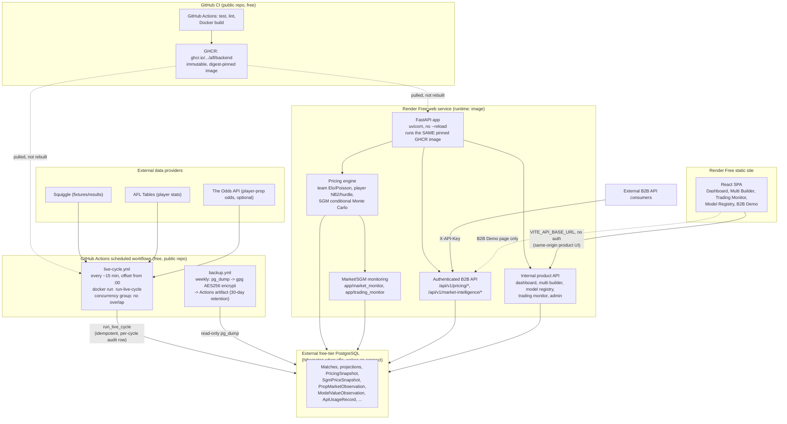

# Architecture

**Status as of the AFL v1 freeze (2026-09-18):** the diagram below is the
*designed* topology — every box is real code/config that exists and has
been verified (CI-built, migration-tested, boots locally), but two boxes
are not currently live. **Actually running in production:** `GitHub CI`,
`GHCR`, and the `live-cycle.yml` scheduled workflow against a real external
Postgres (120+ real scheduled runs; this is what exhausted the real Odds
API usage quota — see the README's Limitations). **Not deployed:** the
`Render Free web service` and `Render Free static site` boxes — `render.yaml`
is written and CI-verifies the image it references, but has never been
applied to a real Render account. Running the product UI today means
running it locally against the same real, live-cycle-populated database.
See [DEPLOYMENT.md](DEPLOYMENT.md) for how these pieces map onto services, and
[OPERATIONS.md](OPERATIONS.md) for how they're run day to day.

## Notes

- **There is no Render background worker and no Render Postgres.** Both
  were real recurring-cost sources (Render has no free plan for background
  workers at all, and free Render Postgres expires 30 days after creation
  with no backups) — see docs/DEPLOYMENT.md's "$0 architecture" section for
  the full reasoning. The live cycle runs as a scheduled GitHub Actions
  workflow instead of a persistent worker process; the database is an
  external free-tier Postgres provider instead of Render Postgres.
- **The backend deploys a pinned GHCR image (`runtime: image`), never a
  Render-side rebuild.** The scheduled live-cycle workflow pulls the exact
  same image — one CI-verified artifact, two consumers, never two
  independently-built copies of the same code.
- **The frontend is a static build, not a container** — it has no
  server-side logic, so it's hosted as static files with an SPA rewrite
  rule, calling the backend cross-origin via `VITE_API_BASE_URL`.
- **`app/market_monitor/` and `app/trading_monitor/` are composition
  layers**, not a separate service — they read the same database the
  pricing engine writes to, read-only.
- **External consumers only ever reach the B2B API surface** (`/api/v1/pricing/*`,
  `/api/v1/market-intelligence/*`), authenticated by API key. Everything
  else under `internal` is same-origin frontend consumption — see
  [OPERATIONS.md](OPERATIONS.md#network-surface) for the full route-by-route
  breakdown.

## Module boundaries (ingestion / modelling / pricing / monitoring)

The `pricing` box above conflates two genuinely different concerns for
diagram brevity — worth separating explicitly, since it's exactly the
seam [docs/NBA_PLATFORM_PLAN.md](NBA_PLATFORM_PLAN.md) needs when reasoning
about what's AFL-specific vs. genuinely shared:

- **Ingestion** (`app/providers/afl/*`, `app/ingest_*`) — fixtures/results
  (Squiggle), historical box scores (AFLTables), weather (Open-Meteo),
  bookmaker odds (The Odds API). AFL-specific per provider, but the
  *pattern* (idempotent upsert by external ID, point-in-time feature
  snapshotting) is not tied to AFL rules.
- **AFL-specific modelling** (`app/modelling/`, `app/player_modelling/`) —
  Elo/Poisson team models and Huber/hurdle player models, all fit on
  AFL's own rules (disposals, goals, margin-of-victory scaling). This is
  the layer a second sport cannot reuse directly — the *shape* of a
  promotion-gated model registry can generalise, the model classes
  themselves cannot.
- **Pricing** (`app/pricing/`) — turns an already-fitted model's output
  into `model_fair_odds`, runs the SGM Monte Carlo engine, and reads
  persisted model state rather than refitting per request. Downstream of
  modelling, upstream of bookmaker integration.
- **Bookmaker integration** (`app/providers/afl/the_odds_api.py`,
  `edges/overround.py`) — real quotes in, de-vig/consensus out. Provider-
  specific at the fetch layer, sport-agnostic at the maths layer (de-vig
  math doesn't know what sport it's devigging).
- **Market intelligence** (`consensus_and_outliers.py`, `app/market_monitor/`) —
  cross-book comparison and rule-based anomaly detection over prices this
  system already computed or fetched. Reads-only over the pricing/bookmaker
  layers; doesn't know or care which sport produced the prices it's
  comparing.
- **Prospective snapshot/evaluation** (`PricingSnapshot`, `PropMarketObservation`,
  `SgmPriceSnapshot`, the model-registry/real-market-tracking evaluation
  modules) — freeze-before-outcome, settle-once, never-overwrite. The
  freeze/settle/evaluate *mechanism* is sport-agnostic; what it freezes
  (a market/selection identity) is defined by the modelling layer above it.
- **Product frontend** (`frontend/src/`) — same-origin consumer of the
  internal API; no sport-specific logic lives in the frontend build itself
  beyond the market/stat labels and routes it renders.
- **Operational monitoring** (`app/trading_monitor/`, `LiveCycleRun`,
  the Live Status/Trading Monitor pages) — orchestration health, data
  freshness, model-value movement over time. Reads the same tables every
  other layer writes; sport-agnostic in shape, currently AFL-only in
  content because nothing else exists to monitor yet.
