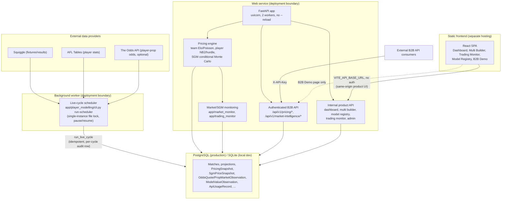

# Architecture

Real components only — nothing below is aspirational. See
[DEPLOYMENT.md](DEPLOYMENT.md) for how these pieces map onto services, and
[OPERATIONS.md](OPERATIONS.md) for how they're run day to day.

## Notes

- **The scheduler and the web service are separate processes** (a Render
  Background Worker and Web Service respectively) — the live cycle never
  runs inside a request handler, so a slow/failed cycle can't affect API
  latency or availability, and vice versa.
- **The frontend is a static build, not a container** — it has no
  server-side logic, so it's hosted as static files with an SPA rewrite
  rule, calling the backend cross-origin via `VITE_API_BASE_URL`.
- **`app/market_monitor/` and `app/trading_monitor/` are composition
  layers**, not a separate service — they read the same database the
  pricing engine writes to, read-only.
- **External consumers only ever reach the B2B API surface** (`/api/v1/pricing/*`,
  `/api/v1/market-intelligence/*`), authenticated by API key. Everything
  else under `internal` is same-origin frontend consumption — see
  [OPERATIONS.md](OPERATIONS.md#network-surface) for the full route-by-route
  breakdown.
